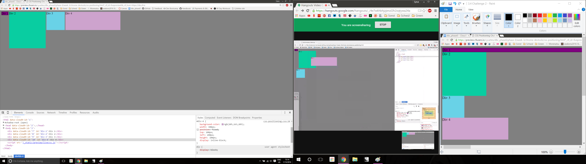

How can you use Chrome's DevTools inspector to help you format or position elements?
  - Devtools give you a quick overview of your sourcecode and formatting, and allows you to quickly edit, add, or remove css formatting for the page.
How can you resize elements on the DOM using CSS?
  - By altering the values for height and weight you can change the size of different DOM elements.
What are the differences between absolute, fixed, static, and relative positioning? Which did you find easiest to use? Which was most difficult?
  - Static positioning means there is no value given to the position (it is unpositioned), and is placed according to the natural flow of the page.
  - Relative positioning places the object relative to its natural (static) position on the page.
  - Fixed positioning places an object at a fixed position on the page relative to the viewpoint. It will not move when the page is scrolled.
  - Absolute positioning is similar to fixed, but it is positioned relative to the last ancestor (or the page, if there is none). It will move with the page when scrolled.
  - I found absolute positioning to be the simplest to use, as it lets you move objects anywhere without concern for other objects. I found relative positioning to be confusing and frustrating, and did not like using it.
What are the differences between margin, border, and padding?
  - Padding is a space surrounding an object which is included in its area. It will not overlap, and is included in background color.
  - Margin is a space surrounding and object, separate from the padding, which is NOT included in its area. Margins will overlap, and is not included with the background.
  - Border is the space between the margin and padding. It can be colored or stroked with different line-types to differentiate object areas.
What was your impression of this challenge overall? (love, hate, and why?)
  - I enjoyed this challenge because it showed me a more in-depth way to use the Chrome dev tools. I've used them a few times in the past, but only for very small tasks such as removing ads from pages. It was interesting to learn about all the different uses for the tools.
