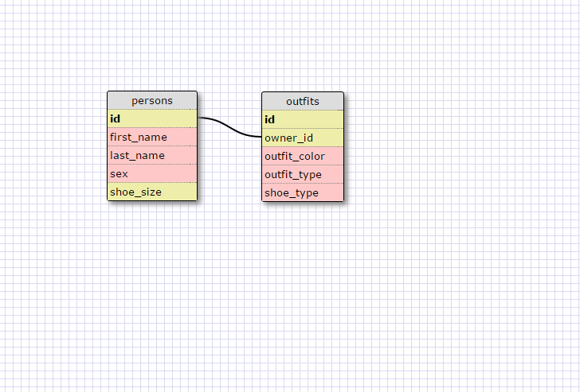

What are databases for?
  Databases are a more effective and efficient way to store data. It works better (and can store more data types) than an array or hash.
What is a one-to-many relationship?
  One-to-many means that one object in a table will be connected to many objects in another table. For example, the above schema would allow each person to own multiple outfits.
What is a primary key? What is a foreign key? How can you determine which is which?
  A primary key is unique for each row, and cannot be duplicated. It shows that each piece of data is unique. A foreign key is a tag that links to another table, allowing you to connect data between them. A foreign key is something like "owner_id" in the above schema, which links to the primary key, "id", from the first table.
How can you select information out of a SQL database? What are some general guidelines for that?
  You can select info from a database in SQL by using the format "SELECT * FROM table-name;", where SELECT is the command, * is the column you want to select (or all, in the case of the asterisk), and FROM table-name determines which table you want to pull data from. Commands are usually capitalized, and each entry ends with a semicolon.