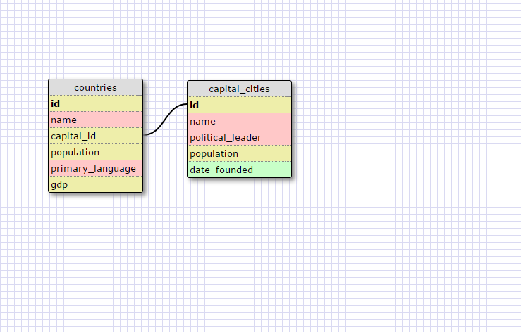
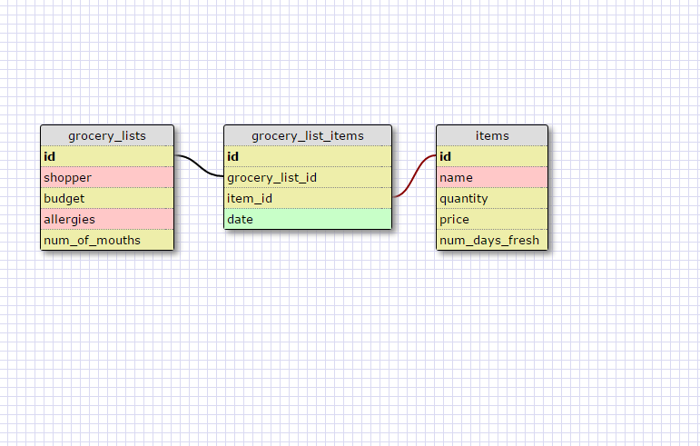

What is a one-to-one database?
  One to one means that each relationship works only once. For example, the first image above shows countries and capitals. Since each country only has one capital, and each capital belongs in only one country, they share a one-to-one relationship.
When would you use a one-to-one database? (Think generally, not in terms of the example you created).
  You would use one when some of the rows can contain a NULL field, or when you would want to have additional information available for one of the tables (like population of capital cities).
What is a many-to-many database?
  Many to many is when each table can connect to multiple instances of another table. For example, students are assigned multiple projects, and each project takes multiple students to complete.
When would you use a many-to-many database? (Think generally, not in terms of the example you created).
  You would use a many-to-many database to connect tables of information that each can be shared multiple times.
What is confusing about database schemas? What makes sense?
  One-to-many and one-to-one databases make sense. I'm still a little confused about the joined table in many-to-many databases.